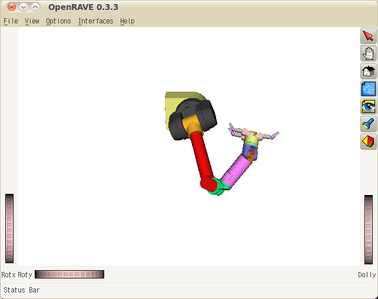

openrave_robot_control ROS Launch Files
=======================================

**Description:** A Robot Control Interface for OpenRAVE

**License:** Apache License, Version 2.0

wam_sim.launch
--------------

.. code-block:: bash

  roslaunch openrave_robot_control wam_sim.launch

This script starts the openrave simulation server and a test controller. The test controller moves the robot and the simulator receives the robot joint angles and moves shows it moving. The script uses the WAM arm and sets the controllable joints usings its manipulator.

  

Contents
########

.. code-block:: xml

  <launch>
    <machine address="localhost" name="wam" />
    <node args="--robotfile robots/barrettsegway.robot.xml --manipname arm --maxvelmult 1.0" machine="wam" name="wam" output="screen" pkg="openrave_robot_control" respawn="false" type="simulationserver">
    </node>
    <node machine="wam" name="openrave" pkg="openrave_robot_control" respawn="false" type="testopenravecontrol.py">
      <env name="PYTHONPATH" value="$(optenv PYTHONPATH):$(find openrave)/share/openrave" />
      <env name="OPENRAVE_PLUGINS" value="$(optenv OPENRAVE_PLUGINS):$(find openrave)/share/openrave/plugins:$(find openrave_robot_control)/lib" />
    </node>
    </launch>

schunkarm_sim.launch
--------------------

.. code-block:: bash

  roslaunch openrave_robot_control schunkarm_sim.launch

The script starts a simulation server for the schunk robot using joints that are manually set.
  

Contents
########

.. code-block:: xml

  <launch>
    <node args="--robotfile robots/schunk-lwa3.zae --jointname j0 --jointname j1 --jointname j2 --jointname j3 --jointname j4 --jointname j5 --jointname j6" name="schunk_simulation" output="screen" pkg="openrave_robot_control" type="simulationserver">
      
      <env name="OPENRAVE_DATA" value="$(optenv OPENRAVE_DATA):$(find openrave)/share/openrave" />
    </node>
    </launch>

